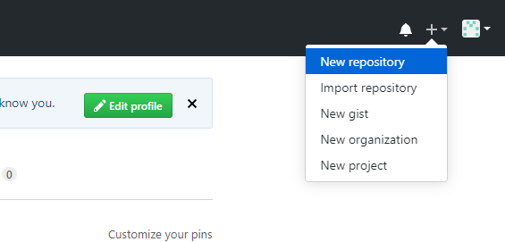
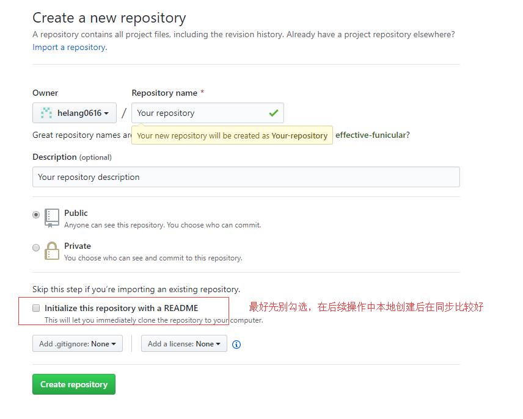
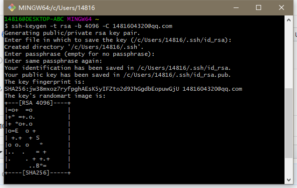
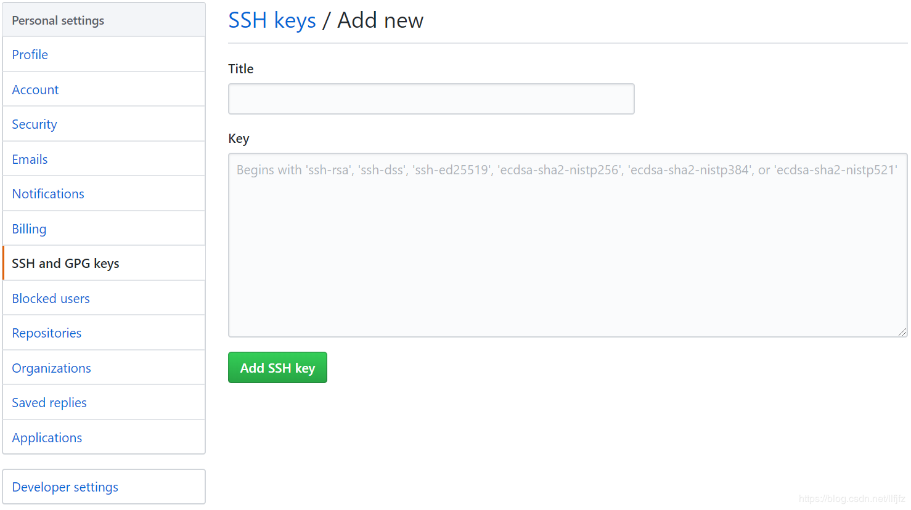
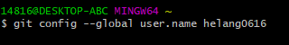
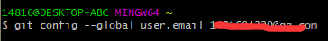
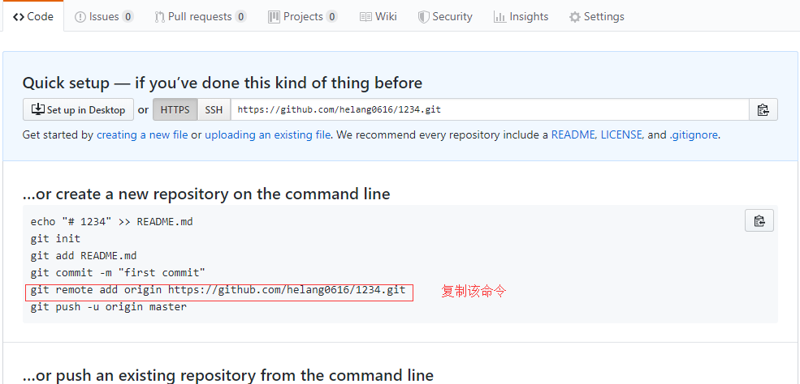

## **创建GitHub项目并在本地同步**

[**注册GitHub账号**](https://github.com/join?source=header-home)


登录后创建GitHub项目



填写项目相关信息



下载[**Git**](https://git-scm.com/downloads)安装并打开Git Bash

***验证是否存在ssh keys***

```
ls -al ~/.ssh
```

***如果不存在ssh密钥，则新建ssh key***

```
ssh-keygen -t rsa -b 4096 -C GitHub邮箱地址
```

填写密钥文件名，也可直接回车保持默认，接下来继续回车，直到密钥创建成功

------



------

密钥地址默认存在C:\Users\your  name\\.ssh

以文本方式打开公钥id_rsa.pub并复制内容到GitHub网站的Settings–>SSH and GPG keys的Key中（Title可随意填写）

------



------

**验证SSH Key是否配置成功***

```
ssh -T GitHub邮箱地址
```

***配置用户名***

```
git config --global user.name "你的用户名"
```



***配置GitHub邮箱地址***

```
git config --global user.email "GitHub邮箱地址"
```



接下来需要在本地初始化GitHub项目，首先用cd命令进入你保存GitHub项目的本地路径

***始化本地Git仓库***

```
git init
```

打开项目Code页

------



------

***添加远程代码仓库URL***

```
git remote add origin 你的项目仓库URL
```

***验证添加是否成功***

```
git remote -v
```

***新建README文档，README文档是每个GitHub项目必备，说明项目内容。上文没有创建，在此处完成。***

```
touch README.md
```

***添加文件夹中的所有文件***

```
git add .
```

***提交文件到项目仓库***

```
git commit -m "你的项目名"
```

***推送本地仓库更新至远程服务器***

```
git push -u origin master
```

**<u>今后需要更新项目，须在本地更新，在Git Bash 中用cd进入本地仓库目录，再执行上述后三条命令即可</u>**

------

