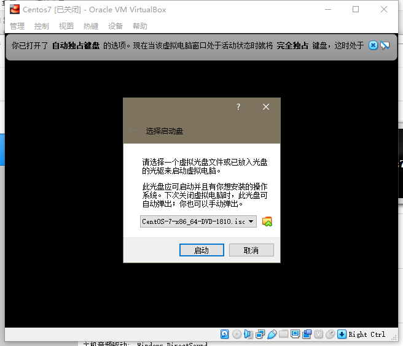

## **本地安装虚拟机和CentOS操作系统**

下载[CentOs镜像](https://www.centos.org/download/)

下载安装[VirtualBox](https://www.virtualbox.org/wiki/Downloads)并打开,新建虚拟系统

------

再根据实际需求创建运行内存及虚拟硬盘大小，其它可保持默认，双击运行刚才创建的CentOs虚拟系统

系统会提示选择系统盘，我们选择我们先前下载的CentOs镜像，启动即可

接下来我们选择第一个选项回车

等待进入centos安装界面，有感叹号的是必须设置的，其他选项可自行选择

选择安装位置，我们就默认选择先前创建的虚拟硬盘

软件选择自行根据需求选择

设置Root密码，创建用户

等待安装完成之后登录即可

------

