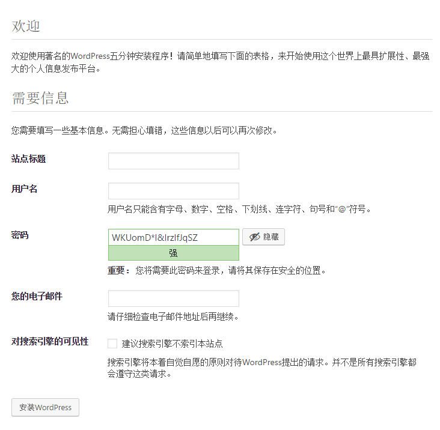

## **CentOS上搭建WordPress博客**

### 1.安装Apache Web服务器

***连接ssh后使用yum安装***

```
sudo yum install httpd
```

输入Y确认安装


***安装完成后，启动Apache Web服务器***

```
sudo systemctl start httpd.service
```

***设置开机自启***

```
systemctl enable httpd.service
```

访问服务器公网IP,出现下图代表Apache安装成功


### 2.安装MySQL

***安装MariaDB***

```
sudo yum install mariadb-server mariadb
```

***启动MariaDB***

```
sudo systemctl start mariadb
```

***设置MySQL的root密码***

```
sudo mysql_secure_installation
```

初始密码为空，提示输入正确密码，直接回车，再设置密码，其他选择Y


***设置开机自启MariaDB***

```
sudo systemctl enable mariadb.service
```

### 3.安装PHP

```
sudo yum install epel-release yum-utils
sudo yum install http://rpms.remirepo.net/enterprise/remi-release-7.rpm
```

***因为WordPress需要php5.6以上版本的支持，我们更新到7.2版本仓库***

```
sudo yum-config-manager --enable remi-php72

```

***安装PHP以及php-mysql***

```
sudo yum install php php-mysql
```

***查看安装的php版本***

```
php -v
```

***重启Apache服务器以支持PHP***

```
sudo systemctl restart httpd.service
```

***为了更好的运行PHP，需要启动PHP附加模块***

```
sudo yum install php-fpm php-gd
```

***重启Apache服务***

```
sudo service httpd restart
```

### 4.安装WordPress以及完成相关配置

***登录数据库***

```
mysql -u root -p
```

***为WordPress创建一个新的数据库***

```
CREATE DATABASE 数据库名 ;
```

***进入刚创建的数据库***

```
use 数据库名 ;
```

***为WordPress创建一个独立的MySQL用户并授权给数据库访问权限***

```
CREATE USER 用户名@localhost IDENTIFIED BY '密码';
GRANT ALL PRIVILEGES ON 数据库名.* TO 用户名@localhost IDENTIFIED BY '密码';
```

***刷新MySQL的权限***

```
FLUSH PRIVILEGES;
```

***安装WordPress***

```
cd ~
wget http://wordpress.org/latest.tar.gz
tar xzvf latest.tar.gz
sudo rsync -avP ~/wordpress/ /var/www/html/
mkdir /var/www/html/wp-content/uploads
sudo chown -R apache:apache /var/www/html/*
```

接下来访问你的服务器公网IP，就能进入WordPress安装的web页


点击继续，填写先前创建的数据库名，用户名及密码


提交后点击安装，填写以下信息



安装完成后即可进入WordPress编辑自己的博客了

