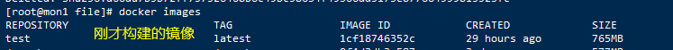
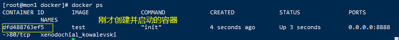
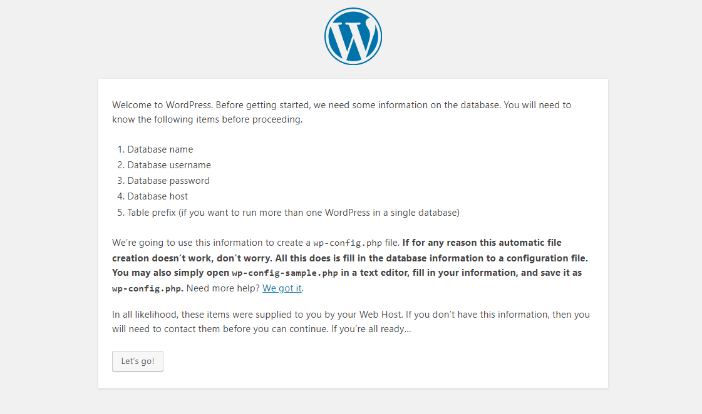
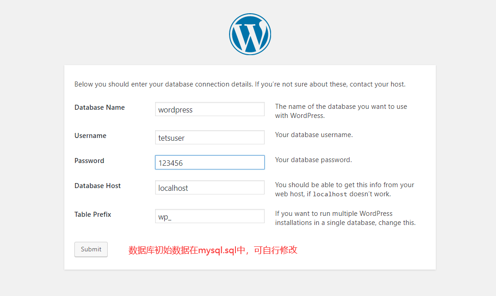
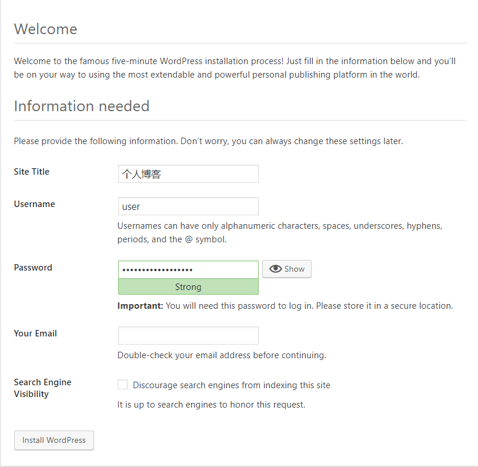
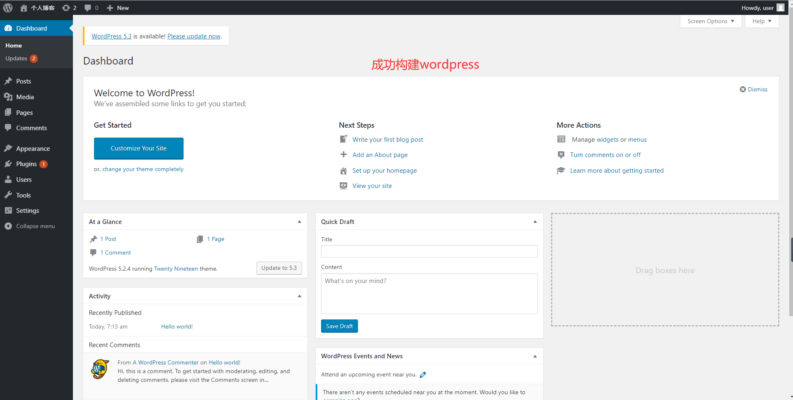

## Dockerfile构建Apache+PHP+Mariadb+Wordpress

### 1.Usage

Dockerfile构建结构

[下载dockerfile](https://github.com/helang0616/Cloud-Computing/tree/master/chapter3/docker )

```
docker
├── dockerfile
└── file
    ├── install.sh
    ├── mysql.sql
    ├── start.service
    ├── start.sh
    └── wordpress.tar.gz
```

```
docker build -t test:v1 .   #构建镜像
docker run -dit --privileged -p 8888:80 test:v1   #创建并启动容器
```

```
docker images   #查询镜像
```



```
docker ps   #查询启动的容器
```



访问 <u>IP:8888</u> 查询结果







  
