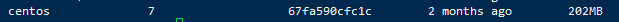

## **Docker基础实验**

### 1.Centos 7安装Docker

 ***更新应用程序数据库*** 

```
sudo yum check-update
```

***添加Docker官方仓库，安装最新Docker***

```
curl -fsSL https://get.docker.com/ | sh
```

***启动Docker***

```
sudo systemctl start docker
```

***设置Docker自启动***

```
sudo systemctl enable docker
```

***查看Docker 版本信息***

```
docker version
```


### 2.Docker加载CentOS镜像

***拉取 Centos  7***

```
docker pull centos:7
```

***拉取完毕后查看镜像***

```
docker images
```



***运行Docker容器（为了方便检测后续wordpress搭建是否成功，需设置端口映射（-p），将容器端口80 映射到主机端口8888，Apache和MySQL需要 systemctl 管理服务启动，需要加上参数 --privileged 来增加权，并且不能使用默认的bash，换成 init，否则会提示 Failed to get D-Bus connection: Operation not permitted ，命令如下 ）***

```
docker run -d -it --privileged --name wordpress -p 8888:80 -d centos:7 /usr/sbin/init
```

***查看已启动的容器***

```
docker ps
```

 

***进入容器前台（容器id可以只写前几位，如 ：f14）***

```
docker exec -it f14 /bin/bash
```


### 3.容器中安装wordpress

参照[**CentOS上搭建WordPress博客**](../chapter2/)

安装完成后可通过浏览器访问  <u>服务器IP:8888</u> 查看


### 4.推送带有wordpress的镜像

***将容器生成镜像  (所生成的镜像名由   "Docker用户名/Docker仓库名"  ，否则推送会报错： denied: requested access to the resource is denied )***

```
docker commit -a "Docker用户名" -m "提交描述" 容器id 镜像名:tag标签
# 举例 docker commit -a "1481604320" -m "wordpress on centos7" f1421c82af6c 1481604320/centos:v1
```

***登录Docker***

```
docker login
```

***推送镜像***

```
docker push 镜像名:tag标签
# 举例  docker push 1481604320/centos:v1
```

***登录Docker网页查看仓库***

