在虚拟机上装centos7，设置用户名和密码

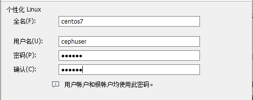             

选择最小安装，不带桌面，

  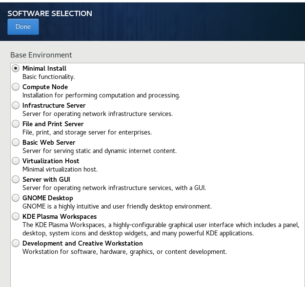

进入系统后，想要粘贴代码很不不方便，用ssh软件连接

先查询ip：ip addr

  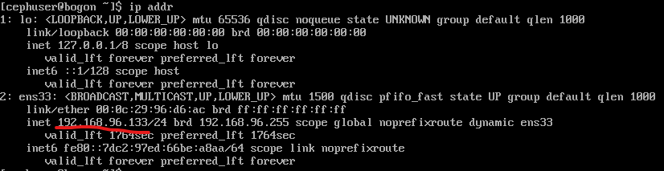

  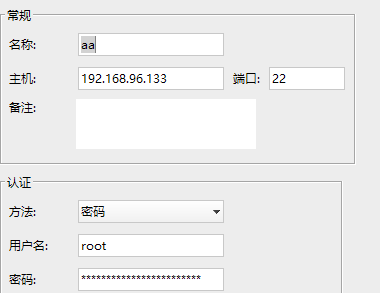

  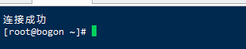

执行全部节点都需执行的命令

添加sudo权限    

echo "cephuser ALL = (root) NOPASSWD:ALL" | sudo tee /etc/sudoers.d/cephuser

chmod 0440 /etc/sudoers.d/cephuser

sed -i s'/Defaults requiretty/#Defaults requiretty'/g /etc/sudoers

  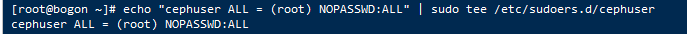

安装配置ntp服务

yum install -y ntp ntpdate ntp-doc

ntpdate 0.us.pool.ntp.org

hwclock --systohc

systemctl enable ntpd.service

systemctl start ntpd.service

  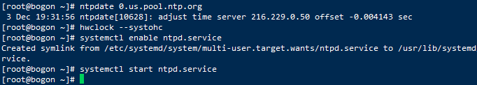

 

禁用SELINUX

sed -i 's/SELINUX=enforcing/SELINUX=disabled/g' /etc/selinux/config

 

虚拟机需运行

yum install -y open-vm-tools

 

 

到目前为止，全部节点相同步骤都已配置完毕，复制虚拟机

  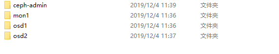

  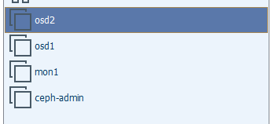

 

<1>主控节点防火墙

sudo firewall-cmd --zone=public --add-port=80/tcp --permanent

sudo firewall-cmd --zone=public --add-port=2003/tcp --permanent

sudo firewall-cmd --zone=public --add-port=4505-4506/tcp --permanent

sudo firewall-cmd –reload

 

 

<2>monistor节点防火墙

sudo firewall-cmd --zone=public --add-port=6789/tcp --permanent

sudo firewall-cmd --reload

 

 

<3>普通节点防火墙

sudo firewall-cmd --zone=public --add-port=6800-7300/tcp --permanent

sudo firewall-cmd –reload

 

 

为osd守护进程创建目录

osd1节点：

sudo mkdir /var/local/osd1

sudo chown ceph:ceph /var/local/osd1

 

osd2节点：

sudo mkdir /var/local/osd2

sudo chown ceph:ceph /var/local/osd2

 

osd3节点：

sudo mkdir /var/local/osd3

sudo chown ceph:ceph /var/local/osd3

 

 

 

主控节点

 

vi /etc/hosts

\#添加如下配置

IP1    ceph-admin

IP2    mon1

IP3    osd1

IP4    osd2

 

设置免密登录ssh

su - cephuser

生成密钥

ssh-keygen

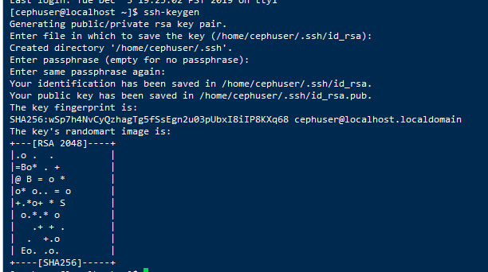  

vi ~/.ssh/config

 

\#添加如下配置

Host ceph-admin

​    Hostname ceph-admin

​    User cephuser

 

Host mon1

​    Hostname mon1

​    User cephuser

 

Host osd1

​    Hostname osd1

​    User cephuser

 

Host osd2

​    Hostname osd2

​    User cephuser

 

 

sudo chmod 644 ~/.ssh/config

 

ssh-keyscan osd1 osd2 mon1 >> ~/.ssh/known_hosts

分发密钥

ssh-copy-id ceph-admin

ssh-copy-id mon1

ssh-copy-id osd1

ssh-copy-id osd2

测试连接各节点ssh

ssh ceph-admin

ssh osd1

ssh osd2

ssh mon1

  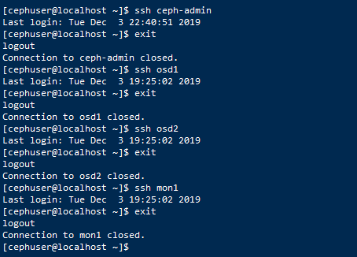

 

ceph-deploy安装

*sudo rpm -Uhv http://download.ceph.com/rpm-jewel/el7/noarch/ceph-release-1-1.el7.noarch.rpm
 sudo yum update -y && sudo yum install ceph-deploy -y*

 

ceph-deploy –version

  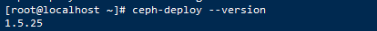

 

创建集群#######################

mkdir my-cluster && cd my-cluster

ceph-deploy new mon1

vi ceph.conf

 

osd pool default size = 2

public network = {ip-address}/{netmask}

在mon1中输入ip addr 查看

  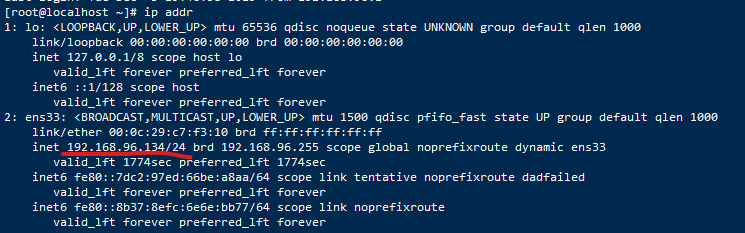

 

修改mon1节点主机名为mon1

hostnamectl set-hostname mon1

在各个节点安装ceph

ceph-deploy install ceph-admin mon1 osd1 osd2

  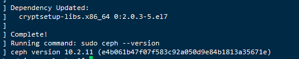

安装完成

初始化mon1节点

ceph-deploy mon create-initial

 

ceph-deploy gatherkeys mon1

完成后会多出几个密钥文件

  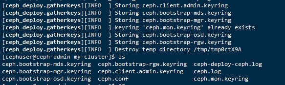

 

将OSDS添加到集群

ceph-deploy osd prepare osd1:/var/local/osd1 osd2:/var/local/osd2

 

ceph-deploy osd activate osd1:/var/local/osd1 osd2:/var/local/osd2

 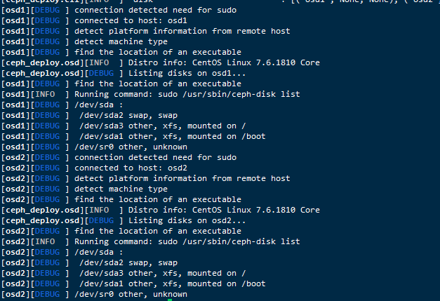

  

 

将管理密钥部署到所有关联的节点

ceph-deploy admin ceph-admin mon1 osd1 osd2

!(./image/17.png)

所有节点执行命令更改密钥文件的权限

*sudo chmod 644 /etc/ceph/ceph.client.admin.keyring*

 

 

*ceph-deploy disk list osd1 osd2*

 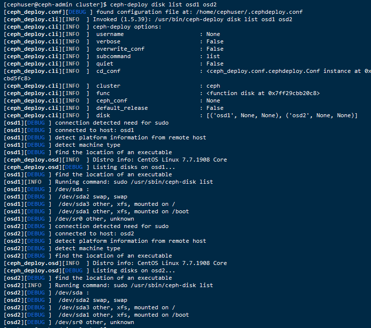

检查集群状态

  

 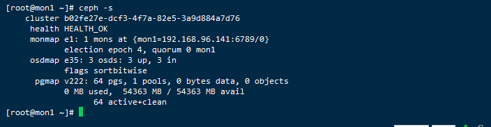

 

  

 

  